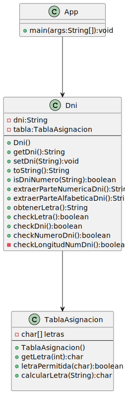

# DNI-refactoring-kata

Small application to calculate the letter of a DNI from its numerical part and check that it matches the DNI given by the user.
Maven is used for dependency management and JUnit5 for the application of the agile TDD methodology.

### UML diagram

